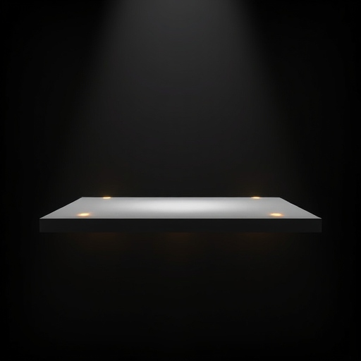

# i3-above-all

<p align="center">
    
</p>

It allows you to open your scratchpad over application in fullscreen.
Solves [this](https://github.com/i3/i3/issues/5673) issue.

### Build

`make`

### Install

`sudo make install`

### Usage

`above_all $width $height $win_id`

in i3wm config

```bash
for_window [ class="super_app" ] move scratchpad
bindsym $mod+space exec pgrep -f 'above_all' && killall above_all || above_all 1200 800 $(xdotool search --class super_app)
```

by this you can toggle your scratchpad with `$mod+space` over application you are running in fullscreen.

